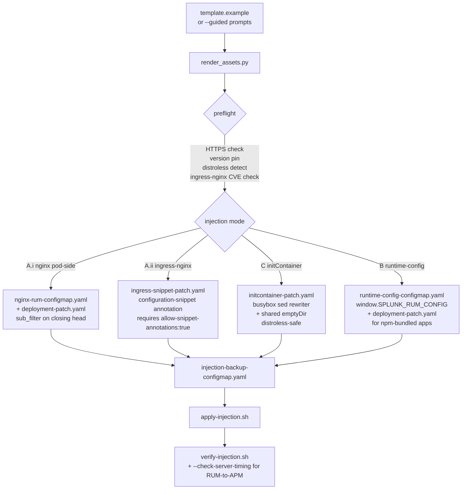

# Splunk Observability Kubernetes Frontend RUM + Session Replay

This skill configures **Splunk Browser RUM** (`@splunk/otel-web` 2.x) plus optional **Session Replay** (Splunk recorder) for frontend applications served from Kubernetes pods. It is a **standalone reusable** skill: Splunk Browser RUM beacons land directly at `rum-ingest.<realm>.observability.splunkcloud.com/v1/rum`, so the Splunk OTel Collector is **not** a prerequisite for the browser side. Use it as the browser instrumentation handoff when a Digital Experience Analytics (DXA) request needs RUM agent setup, source maps, user tracking, session replay, or frustration signals.

> **Disambiguation**: this is **Splunk Browser RUM**, not **AppDynamics BRUM**. AppDynamics Browser Real User Monitoring is handled by [splunk-appdynamics-eum-setup](../splunk-appdynamics-eum-setup/SKILL.md). The two products and their SDKs are distinct.

## Architecture: four injection modes



Istio EnvoyFilter / Lua body-rewrite injection is intentionally **not** rendered. Service-mesh users can use mode A.i (pod-side nginx) like everyone else.

## What it renders

- `k8s-rum/` — only manifests for the chosen injection mode(s):
  - Mode A.i: `nginx-rum-configmap.yaml` (server-block snippet with `sub_filter '</head>' '<the-rendered-snippet></head>';`, `sub_filter_types text/html;`, `sub_filter_once on;`, optional `proxy_set_header Accept-Encoding "";` for proxied flavors), `nginx-deployment-patch.yaml`.
  - Mode A.ii: `ingress-snippet-patch.yaml` (strategic-merge of the Ingress object's `nginx.ingress.kubernetes.io/configuration-snippet` annotation).
  - Mode C: `initcontainer-patch.yaml` (`busybox:1.36` initContainer with shared `emptyDir` mounted at the served HTML path; auto-routes through the utility image when the target image looks distroless).
  - Mode B: `runtime-config-configmap.yaml` (contains `window.SPLUNK_RUM_CONFIG = {...}`), `runtime-config-deployment-patch.yaml`, `bootstrap-snippet.html`.
  - `injection-backup-configmap.yaml` — snapshot of the original deployment manifest fragment for clean revert.
  - `apply-injection.sh`, `uninstall-injection.sh`, `verify-injection.sh`, `status.sh`.
- `discovery/workloads.yaml`, `discovery/services.yaml` — only with `--discover-frontend-workloads`.
- `source-maps/sourcemap-upload.sh` — wraps `splunk-rum sourcemaps inject --path <dist>` and `splunk-rum sourcemaps upload --path <dist> --app-name <app> --app-version <version>`. Reads `SPLUNK_O11Y_TOKEN_FILE`.
- `source-maps/github-actions.yaml` — sample GitHub Actions job snippet.
- `source-maps/gitlab-ci.yaml` — sample GitLab CI job snippet.
- `source-maps/splunk.webpack.js` — sample Webpack 5 plugin config using `@splunk/rum-build-plugins`.
- `runbook.md` — ordered operator workflow.
- `preflight-report.md` — every fail / warn / advisory finding.
- `handoff-dashboards.sh` — calls [splunk-observability-dashboard-builder](../splunk-observability-dashboard-builder/SKILL.md) with the rendered spec.
- `handoff-detectors.sh` — calls [splunk-observability-native-ops](../splunk-observability-native-ops/SKILL.md) with starter RUM detectors.
- `handoff-cloud-integration.sh` — advisory pointer to [splunk-observability-cloud-integration-setup](../splunk-observability-cloud-integration-setup/SKILL.md) for the existing `rum` SIM modular input.
- `handoff-auto-instrumentation.sh` — emitted ONLY when `validate.sh --check-server-timing` shows the backend is missing the traceparent header.
- `metadata.json` — spec digest, preflight verdicts, rendered file list, target workload list.

There is no `handoff-base-collector.sh` because RUM beacons direct to ingest.

## Safety Rules

- Never ask for any credential in conversation. Two distinct token files are honored:
  - `SPLUNK_O11Y_RUM_TOKEN_FILE` — RUM access token. Embedded literally into the rendered JS snippet (RUM tokens are inherently public once served to browsers, but the file-path pattern still satisfies the repo's secret-handling rules).
  - `SPLUNK_O11Y_TOKEN_FILE` — existing Org Access Token. Reused for `splunk-rum sourcemaps upload` (org scope, not the RUM token).
- `setup.sh` rejects raw token CLI flags: `--rum-token`, `--access-token`, `--token`, `--bearer-token`, `--api-token`, `--o11y-token`, `--sf-token`, `--hec-token`, `--platform-hec-token`, `--api-key`.
- Mutating operations are gated. `--apply-injection` and `--uninstall-injection` require `--accept-frontend-injection` (because both force pod restarts). Session Replay rendering requires `--accept-session-replay-enterprise` (enterprise-tier feature).
- All rendered scripts are idempotent and refuse to run when expected preconditions (rendered manifest set, backup ConfigMap populated, `kubectl` available) are not met.
- The renderer NEVER reads source maps, application source, or any operator JavaScript; it only emits configuration files and helpers.

## Primary Workflow

1. (Optional) Discover frontend workload candidates. Read-only, no mutation:

   ```bash
   bash skills/splunk-observability-k8s-frontend-rum-setup/scripts/setup.sh \
     --discover-frontend-workloads \
     --realm us0
   ```

   Edit `splunk-observability-k8s-frontend-rum-rendered/discovery/workloads.yaml` to set per-workload `injection_mode`.

2. Render the assets:

   ```bash
   bash skills/splunk-observability-k8s-frontend-rum-setup/scripts/setup.sh \
     --render \
     --realm us0 \
     --application-name acme-checkout \
     --deployment-environment prod \
     --version 1.42.0 \
     --workload Deployment/prod/checkout-web=nginx-configmap
   ```

3. Or run guided mode. Walks the operator through every SplunkRum.init knob, every Session Replay knob, every Frustration Signals knob, then writes a spec and renders:

   ```bash
   bash skills/splunk-observability-k8s-frontend-rum-setup/scripts/setup.sh --guided
   ```

4. Review `splunk-observability-k8s-frontend-rum-rendered/`:
   - `preflight-report.md` — every fail / warn / advisory finding.
   - `runbook.md` — ordered operator steps.
   - `k8s-rum/` — the manifests that will be applied.

5. Apply (gated):

   ```bash
   bash skills/splunk-observability-k8s-frontend-rum-setup/scripts/setup.sh \
     --apply-injection \
     --accept-frontend-injection
   ```

6. Verify:

   ```bash
   bash skills/splunk-observability-k8s-frontend-rum-setup/scripts/validate.sh \
     --live --check-injection https://checkout.example.com
   ```

## Injection Modes

| Mode | When to pick | Pod changes | Ingress changes |
|------|--------------|-------------|-----------------|
| A.i `nginx-configmap` | Frontend served by nginx in the pod (most React/Vue/Angular SPA dist on `nginx:alpine`). Default. | Mount ConfigMap into `/etc/nginx/conf.d/`. Rollout restart. | None |
| A.ii `ingress-snippet` | Cluster runs ingress-nginx and operator owns the Ingress object. **Requires `allow-snippet-annotations: "true"` on the controller** (default false since CVE-2021-25742). | None | Patch annotation on the Ingress |
| C `init-container` | Distroless or non-nginx static-file server (httpd, busybox-served, custom). Works with any frontend container. | Add initContainer + shared `emptyDir`. Rollout restart. | None |
| B `runtime-config` | App already bundles `@splunk/otel-web` via npm and just needs realm + token + applicationName at runtime. | Mount ConfigMap of `window.SPLUNK_RUM_CONFIG`. Rollout restart. | None |

See [references/injection-modes.md](references/injection-modes.md) for the deep dive (gzip pitfall, distroless caveats, nginx vs nginx-unprivileged conf.d paths, ingress-nginx CVE history).

## Session Replay

Enterprise-tier feature. Default off. To enable:

```bash
bash skills/splunk-observability-k8s-frontend-rum-setup/scripts/setup.sh \
  --render \
  --enable-session-replay \
  --accept-session-replay-enterprise \
  --session-replay-sampler-ratio 0.5
```

Renders the `splunk-otel-web-session-recorder.js` script tag and a `SplunkSessionRecorder.init(...)` call with the new Splunk recorder format (`recorder: 'splunk'`). The renderer surfaces every privacy and feature knob: `maskAllInputs`, `maskAllText`, `sensitivityRules[]`, `maxExportIntervalMs`, `sampler.ratio`, `features.{canvas, video, iframes, packAssets, cacheAssets, backgroundServiceSrc}`. See [references/session-replay-privacy.md](references/session-replay-privacy.md) and the rrweb→Splunk recorder migration table.

## Frustration Signals 2.0

The skill exposes the full Frustration Signals 2.0 surface. `rageClick` is on by default; `deadClick`, `errorClick`, and `thrashedCursor` are opt-in. `thrashedCursor` has 14 tuning knobs (timeWindowMs, throttleMs, minDirectionChanges, etc.). See [references/frustration-signals.md](references/frustration-signals.md).

## Manual Instrumentation

Manual instrumentation hooks (custom workflow spans for the DEA Custom Events tab, `SplunkRum.setGlobalAttributes()`, `enduser.id` / `enduser.role`, per-framework error handlers for React / Vue 2/3 / Angular 1/2+ / Ember) are documented in [references/manual-instrumentation.md](references/manual-instrumentation.md). The skill renders advisory snippets only; integrating them is the operator's responsibility.

## Source Maps

When `source_maps.enabled: true` (default), the skill renders a `source-maps/sourcemap-upload.sh` helper plus sample CI snippets. The helper wraps the `splunk-rum` CLI:

```bash
splunk-rum sourcemaps inject --path dist
splunk-rum sourcemaps upload --path dist --app-name "$APP_NAME" --app-version "$APP_VERSION"
```

Source map upload requires the **Org Access Token** (`SPLUNK_O11Y_TOKEN_FILE`), not the RUM token. See [references/source-maps.md](references/source-maps.md).

## RUM-to-APM Linking

Splunk Browser RUM links front-end traces to back-end APM traces via the `Server-Timing: traceparent;desc="00-{trace_id}-{span_id}-01"` HTTP response header on backend responses. Backends instrumented via [splunk-observability-k8s-auto-instrumentation-setup](../splunk-observability-k8s-auto-instrumentation-setup/SKILL.md) emit the header automatically. CORS callers need `Access-Control-Expose-Headers: Server-Timing`. The validation surface includes `--check-server-timing <backend-url>`; if the backend is missing the header, the skill emits `handoff-auto-instrumentation.sh` pointing at the auto-instrumentation skill. See [references/apm-linking.md](references/apm-linking.md).

## Hand-offs

- Dashboards: [splunk-observability-dashboard-builder](../splunk-observability-dashboard-builder/SKILL.md) — RUM web vitals (LCP, CLS, INP, FCP, TTFB), page-view rate, JS error rate, frustration signal counts, sessions per app, route-change funnels.
- Detectors: [splunk-observability-native-ops](../splunk-observability-native-ops/SKILL.md) — web vitals SLO breach, JS error spike, rage-click rate, dead-click ratio, page-view drop.
- Splunk Platform companion: [splunk-observability-cloud-integration-setup](../splunk-observability-cloud-integration-setup/SKILL.md) — toggles the existing `rum` SIM modular input from the [sim-modular-inputs.md](../splunk-observability-cloud-integration-setup/references/sim-modular-inputs.md) catalog (page_view, client_error, page_view_time p75, web vitals LCP/CLS/FID into Splunk Platform).
- RUM-to-APM linking: [splunk-observability-k8s-auto-instrumentation-setup](../splunk-observability-k8s-auto-instrumentation-setup/SKILL.md) — only emitted as `handoff-auto-instrumentation.sh` when `--check-server-timing` validation fails.

## Out of scope

- Backend application auto-instrumentation (handoff to [splunk-observability-k8s-auto-instrumentation-setup](../splunk-observability-k8s-auto-instrumentation-setup/SKILL.md) when `validate.sh --check-server-timing` shows missing trace context).
- iOS / Android Mobile RUM (separate Splunk RUM mobile agents, not browser).
- WebView instrumentation inside native apps (advisory only; documented in [references/framework-notes.md](references/framework-notes.md)).
- Modifying application source code or build pipelines beyond the Webpack plugin / CLI source-map helper. Mode B (runtime-config ConfigMap) covers the npm-bundled SDK case at the K8s layer.
- CSP header rewriting (advisory only — emits exact `Content-Security-Policy` header lines but does not patch ingress headers).
- Istio EnvoyFilter / Lua body-rewrite injection (intentionally not rendered — mesh users use mode A.i).
- AppDynamics Browser RUM (handled by [splunk-appdynamics-eum-setup](../splunk-appdynamics-eum-setup/SKILL.md)).
- FedRAMP / GovCloud Browser RUM (not currently supported by the Splunk Browser RUM agent — documented in [references/realms-and-endpoints.md](references/realms-and-endpoints.md)).
- Pre-emptive cookie-consent banner integration (operator's responsibility; documented as legal note in [references/session-replay-privacy.md](references/session-replay-privacy.md)).

## Validation

```bash
bash skills/splunk-observability-k8s-frontend-rum-setup/scripts/validate.sh
```

Static checks cover:

- YAML well-formedness of every rendered manifest.
- Every `<script src=>` is HTTPS (no HTTP).
- Agent version is pinned (refuses `latest` unless `--allow-latest-version`).
- When the agent version is an exact `vX.Y.Z` pin, the `<script>` tag includes a populated `integrity="sha384-..."` attribute (operator-supplied or skipped with a note).
- When Session Replay is enabled with `recorder: splunk`, the rrweb-legacy options (`maskTextSelector`, `maskInputOptions`, `maskTextClass`, `inlineImages`, `collectFonts`) are NOT present.
- Mode A.i nginx config includes `sub_filter_types text/html;` and either `proxy_set_header Accept-Encoding "";` (proxied) or a documented gzip note (static-file).
- Mode C initContainer uses a separate utility image when the target image looks distroless.
- Workload patches target only the specified workload kind/namespace/name.
- Rendered scripts do not echo secrets.

With `--live`:

- `--check-injection <url>` — `curl -sL` the served URL and grep for `SplunkRum.init(`.
- `--check-session-replay <url>` — same plus `SplunkSessionRecorder.init(` when enabled.
- `--check-csp <url>` — `curl -I` and parse `Content-Security-Policy` for required entries.
- `--check-rum-ingest` — DNS + TCP probe of `rum-ingest.<realm>.observability.splunkcloud.com:443`.
- `--check-server-timing <backend-url>` — `curl -sI` and grep for `Server-Timing.*traceparent`. Emits `handoff-auto-instrumentation.sh` if missing.

See [reference.md](reference.md) for the full CLI flag reference and the twelve `references/*.md` annexes for deep topical documentation.
